## Sequential Function Chart
##### Eko Rudiawan @ 2018
---

### Sequential Function Chart
* SFC merupakan bahasa pemrograman yang didefinisikan pada standar IEC 61131-3.
* SFC merupakan bahasa pemrograman berbasis graphic yang digunakan untuk merepresentasikan sequence/urutan proses dalam sebuah program. 
* SFC disebut juga dengan Grafcet yang mengacu pada standar French National Standar. 
* SFC didesain untuk membuat program terstruktur 
* SFC didesain untuk membuat program terstruktur terutama untuk sistem yang beroperasi secara sequential dan paralel. 
---

### Struktur Utama SFC
* **Steps** merupakan urutan dari sebuah proses yang akan dijalankan. 
* **Transitions** berisi sebuah kondisi/syarat yang harus terpenuhi agar sebuah step dapat diproses. 
* **Actions** merupakan sebuah step yang berisi aksi yang akan dilakukan pada sebuah proses. 
---

### Contoh Program SFC
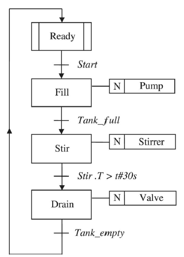
---

### Simbol Pada SFC

* **Steps** 
    * Initial Step 
    * Ordinary Step 
* **Transitions** 
* **Alternative Sequences** 
    * Alternative Convergence 
    * Alternative Divergence 
* **Paralel Sequences** 
    * Parallel Divergence 
    * Parallel Convergence 
* **Jump** 

---

### Steps
* **Initial Step** : Proses yang akan dieksekusi pertama kali ketika program dijalankan. 

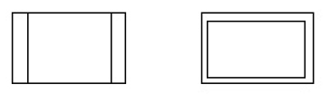

* **Ordinary Step** : Proses lain yang akan dijalankan ketika sebuah kondisi transition telah terpenuhi. 

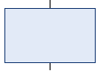
---

### Transitions
**Transition** merupakan sebuah syarat yang harus terpenuhi jika step ingin dieksekusi 

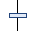
---

### Alternative Branch
* **Alternative Divergence** : Kondisi masuk ke percabangan. 

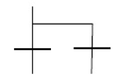

* **Alternative Convergence** : Kondisi keluar dari percabangan. 

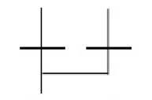
---

### Alternative Branch
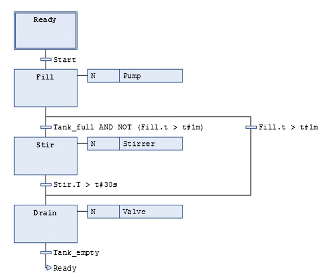
---

### Parallel Branch
* **Parallel Divergence** : Masuk ke percabangan secara parallel. 

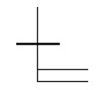

* **Parallel Convergence** : Keluar dari percabangan parallel. 

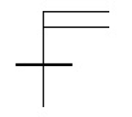
---

### Parallel Branch
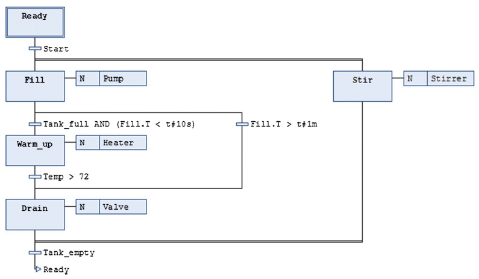
---

### Steps 

Setiap step secara otomatis akan meng-*generate* sebuah variabel yang disebut dengan **Step Address** 

* **Step Addresses**
    * **Step_Name.X** : Kondisi aktif atau tidaknya sebuah Step.
    * **Step_Name.T** : Bernilai waktu berapa lama Step telah aktif
---

### Transitions
**Transition** selalu bernilai akhir **TRUE/FALSE**
* **Divergence** : masuk ke dalam sebuah percabangan
* **Covergence** : keluar dari sebuah percabangan
---

### Actions
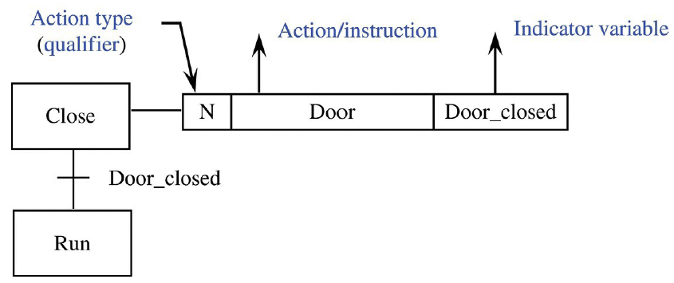
* **Action Types** : Bagaimana dan kapan aksi tersebut dieksekusi. 
* **Action Control** : Berisi variabel yang akan dikontrol
* **Indicator Variable** : Variabel sebagai indikator bahwa action step telah dieksekusi
---

#### SFC action types
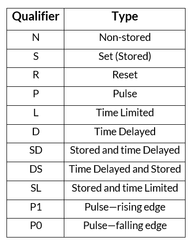
---