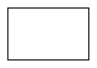

# White

## Sequential Function Chart
##### Eko Rudiawan @ 2018

---

### Pendahuluan
* SFC merupakan bahasa pemrograman yang didefinisikan pada standar IEC 61131-3.
* SFC merupakan bahasa pemrograman berbasis graphic yang digunakan untuk merepresentasikan sekuen/urutan dalam sebuah program.
* SFC disebut juga dengan Grafcet yang mengacu pada standar French National Standar.
* SFC didesain untuk membuat program terstruktur terutama untuk sistem yang beroperasi secara sequential dan paralel.

---

### Structure Utama SFC
1. **Steps** merupakan urutan dari sebuah proses yang akan dijalankan
2. **Transitions** berisi sebuah kondisi/syarat yang harus terpenuhi untuk melakukan perpindahan antar step. 
3. **Actions** merupakan sebuah step yang berisi instruksi yang akan dilakukan pada sebuah proses.
---

### Simbol Pada SFC

1. **Steps** 
    * Initial Step 

    * Ordinary Step

        

2. **Transitions** 

    

3. **Paralel Sequences**
    * Parallel Divergence

        

    * Parallel Convergence

        

4. **Alternative Sequences**
    * Alternative Convergence

        

    * Alternative Divergence

        

5. **Jump**

    

---
### Steps 
* Step Addresses
    * Step_Name.X
    * Step_name.T

---

### Transitions
* Covergence, keluar dari perbacangan
* Divergence, masuk dalam percabangan

---

### Actions
* Action Types
* Action Control
* Indicator Variable

---

#### SFC action types
|Qualifier|Type|
|---------|----|
|N|Non-stored|
|S|Set (Stored)|
|R|Reset|
|P|Pulse|
|L|Time Limited|
|D|Time Delayed|
|SD|Stored and time Delayed|
|DS|Time Delayed and Stored|
|SL|Stored and time Limited|
|P1|Pulse—rising edge|
|P0|Pulse—falling edge|

---