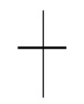

## Sequential Function Chart
##### Eko Rudiawan @ 2018
---

### Pendahuluan
* SFC merupakan bahasa pemrograman yang didefinisikan pada standar IEC 61131-3.
* SFC merupakan bahasa pemrograman berbasis graphic yang digunakan untuk merepresentasikan sequence/urutan proses dalam sebuah program.
* SFC disebut juga dengan Grafcet yang mengacu pada standar French National Standar.
* SFC didesain untuk membuat program terstruktur terutama untuk sistem yang beroperasi secara sequential dan paralel.
---

### Structure Utama SFC
1. **Steps** merupakan urutan dari sebuah proses yang akan dijalankan.
2. **Transitions** berisi sebuah kondisi/syarat yang harus terpenuhi agar sebuah step dapat diproses. 
3. **Actions** merupakan sebuah step yang berisi aksi yang akan dilakukan pada sebuah proses.
---

### Contoh Program SFC

---

### Simbol Pada SFC
1. **Steps** 
    * Initial Step
    * Ordinary Step
2. **Transitions** 
3. **Alternative Sequences**
    * Alternative Convergence
    * Alternative Divergence
4. **Paralel Sequences**
    * Parallel Divergence
    * Parallel Convergence
5. **Jump**
---

### Steps
* Initial Step : Proses yang akan dieksekusi pertama kali ketika program dijalankan.

* Ordinary Step : Proses lain yang akan dijalankan ketika sebuah kondisi transition telah terpenuhi.

---

### Transitions
Transition merupakan sebuah syarat yang harus terpenuhi jika step ingin dieksekusi

---

### Alternative Sequence
* Alternative Divergence : Kondisi masuk ke percabangan.

* Alternative Convergence : Kondisi keluar dari percabangan.

---

### Alternative Sequence

---

### Parallel Sequence
* Parallel Divergence : Masuk ke percabangan secara parallel.

* Parallel Convergence : Keluar dari percabangan parallel.

---

### Parallel Sequence

---

### Steps 

Setiap step secara otomatis akan meng-*generate* sebuah variabel yang disebut dengan **Step Address**

* Step Addresses
    * Step_Name.X : Kondisi aktif atau tidaknya sebuah Step.
    * Step_name.T : Bernilai waktu berapa lama Step telah aktif
---

### Transitions
Transition selalu bernilai akhir **TRUE/FALSE**
* Divergence, masuk ke dalam sebuah percabangan
* Covergence, keluar dari sebuah percabangan
---

### Actions

* Action Types : Bagaimana dan kapan aksi tersebut dieksekusi
* Action Control
* Indicator Variable
---

#### SFC action types
|Qualifier|Type|
|---------|----|
|N|Non-stored|
|S|Set (Stored)|
|R|Reset|
|P|Pulse|
|L|Time Limited|
|D|Time Delayed|
|SD|Stored and time Delayed|
|DS|Time Delayed and Stored|
|SL|Stored and time Limited|
|P1|Pulse—rising edge|
|P0|Pulse—falling edge|
---